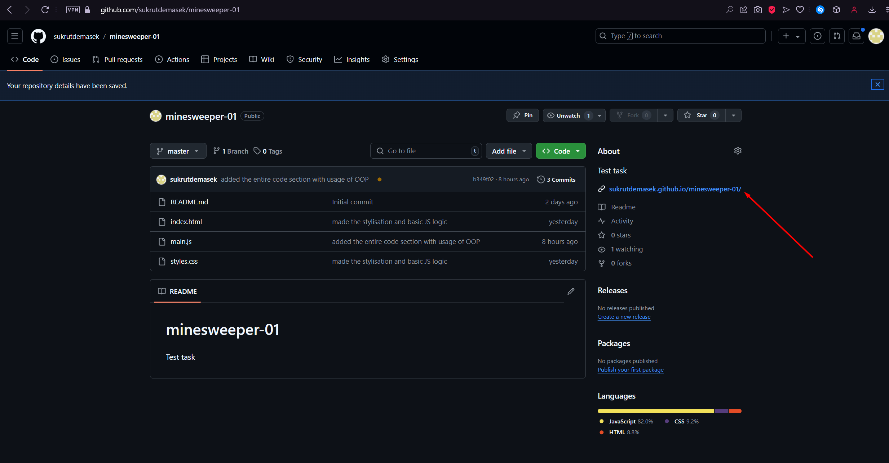

Вітаю, ревьювери команди PlayToMax!

В цьому файлі буде детально описано не лише процес запуску мого веб-додатка, створеного за наданим ТЗ, але й детальний опис коду!

Щоб перевірити моє тестове завдання, вам достатньо клікнути по посиланню на сторінці цього репозиторію, в секції About.

В новій вкладці відкриється мій сайт, і ви зможете перевірити тестове завдання!
Щоб відкрити плитку, натисніть на неї ЛКМ.

Саме завдання для мене не є новим, близько року тому я для свого власного проекту робив гру Сапер (Minesweeper), яка має схожий принцип роботи (втім, багато деталей я змінив, оскільки набув досвіду). ви можете з нею ознайомитись за посиланням: https://github.com/sukrutdemasek/old-minesweeper

Якщо ви бажаєте ознайомитись з моїм кодом, усі значимі елементи в будь-якому скрипті, будь-то HTML, CSS, чи JS мають короткий коментар з описом функціоналу.

Сподіваюсь, вам сподобається моя робота! Дякую за ваш час!
